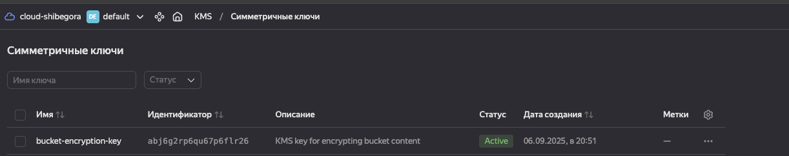
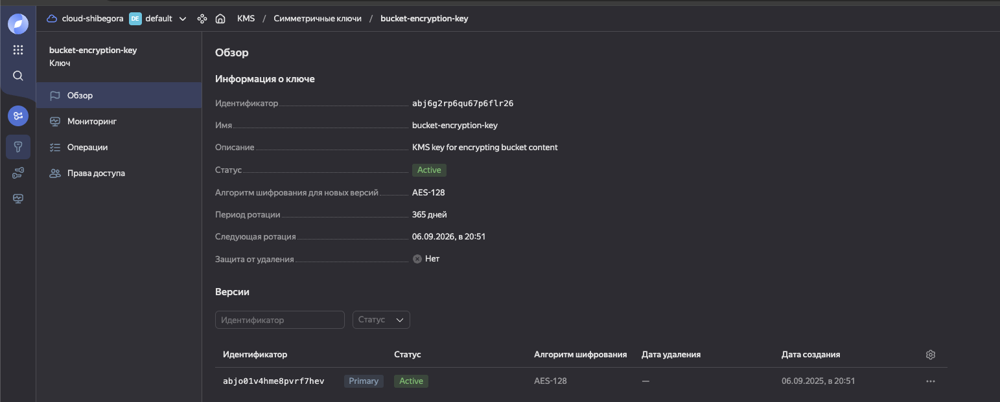
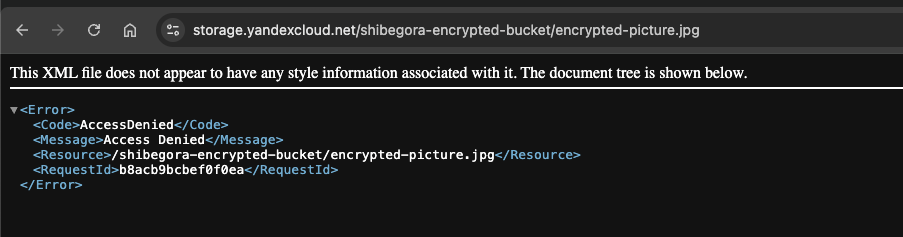

Для выполнения задания взял код от предыдущего занятия и доработал его добавив симметричный ключ с периодом ротации на год.

В блок с бакетом подключил этот ключ.

Что получилось после разворота
симметричный ключ

бакет с зашифрованной картинкой

