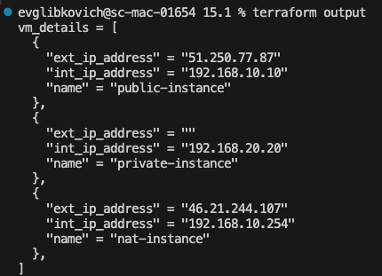
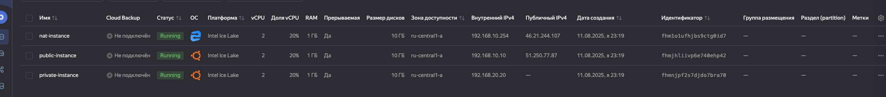
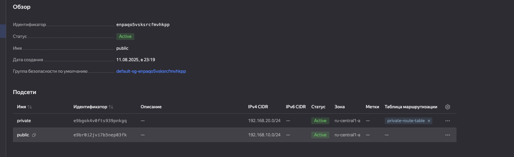
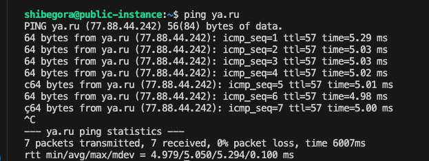
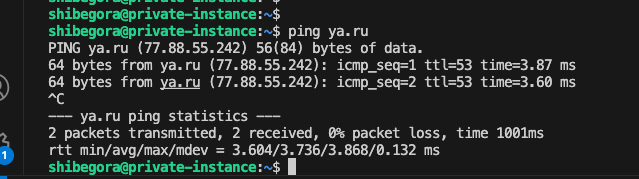

Развернул виртуалки в соответствии с заданием





А так-же сеть и подсети (видно, что к private зацеплена таблица маршрутов)


Таблица маршрутов


Пинг ya.ru с public инстанса



почему то у меня не получается нормально подключиться к привату, видимо из за ключей на рабочем ноутбуке, хотя явно указываю ключ, через который требуется подключиться. 
Получилось только через команду:
```
ssh -o "ProxyCommand ssh -i ~/.ssh/yandex_cloud -W %h:%p shibegora@46.21.244.107" \
    -i ~/.ssh/yandex_cloud shibegora@192.168.20.20
```

